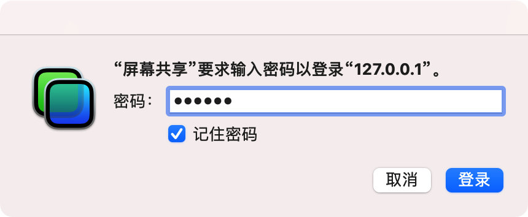
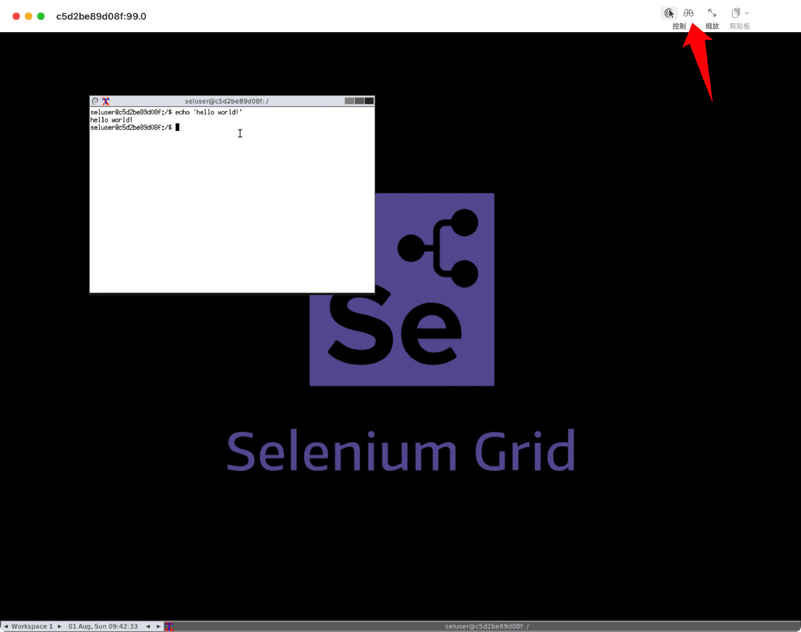
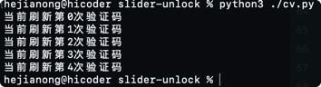
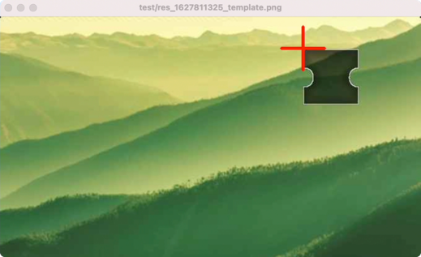

## 滑动验证码破解

- 此项目仅学习用途

> 基于opencv图像识别 + selenium模拟滑动 + python实现的滑块验证码破解项目，支持RPC调用，自动化浏览器操作，可视化远程VNC连接，自定义重试策略等操作...目前为Demo阶段，有需要请阅读代码注释自行改造

**支持验证码列表及成功率展示如下:**

|厂家|类型|成功率|
|----|----|----|
|[腾讯防水墙](https://007.qq.com)|滑块|99%|

### 运行Demo

> 基础环境为python3 + pip3
> 
> 以及需要webdriver服务，以下用docker部署

- **安装依赖:**

```shell
pip3 install numpy opencv-python requests pillow
```

- **启动selenium chrome webdriver**

```shell
docker run -d -p 4444:4444 -p 5900:5900 --shm-size="2g" selenium/standalone-chrome:4.0.0-rc-1-prerelease-20210713
```

M1芯片请使用以下镜像尝试, [参考](https://github.com/SeleniumHQ/docker-selenium/issues/1076)

```shell
docker run -d -p 4444:4444 -p 5900:5900 --shm-size="2g" seleniarm/standalone-chromium:4.0.0-beta-1-20210215
```

> 这里`4444`端口为webdriver，而`5900`端口为VNC可视化连接端口，可后续连接VNC查看demo运行时的一些可视化表现。这里使用 [docker-selenium](https://github.com/SeleniumHQ/docker-selenium) 项目运行webdriver，后续有需要可自行扩容为webdriver集群

- **访问VNC屏幕(可选)**

浏览器访问 [vnc://127.0.0.1:5900](vnc://127.0.0.1:5900) 确认后会弹出VNC的密码输入弹窗，输入`secret`即可访问 




记得把控制改为仅观看，防止后续影响运行



- **然后运行`cv.py`**

```shell
python3 ./cv.py
```

不出意外就能看到打印出在刷新验证码了，然后会将识别并计算完成后的结果窗口弹出(按任意键即关闭)，识别出的滑动定位将会有红色坐标标识，如下:





这里代码中只设置执行了5次，如果需要更多次可改代码然后最后看识别成功率，或访问`/test`目录

### 演示


---

后续再调用selenium的api去模拟滑动即可，代码中的注释比较多是当时学习opencv时留下的，有需要可具体查看代码并根据自己的需求作优化

